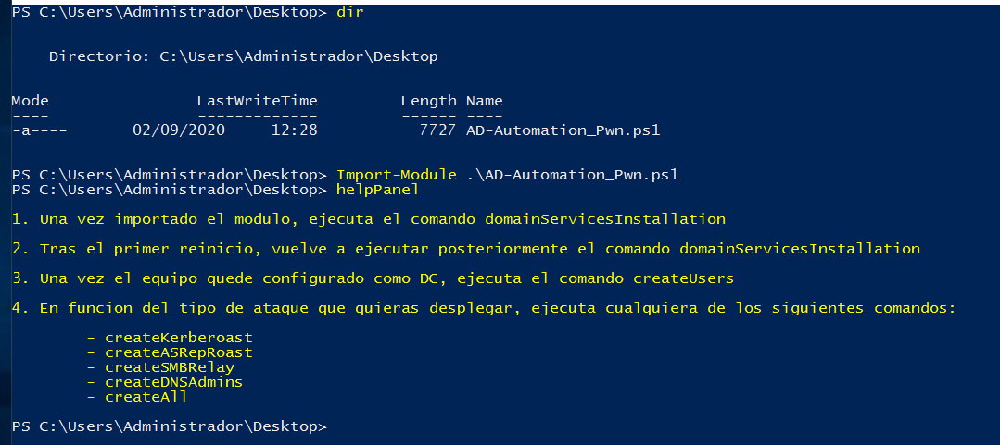
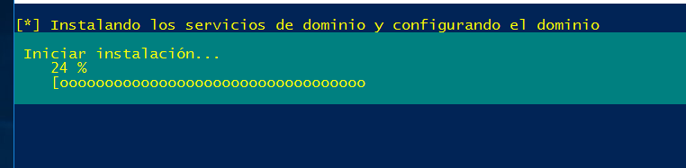
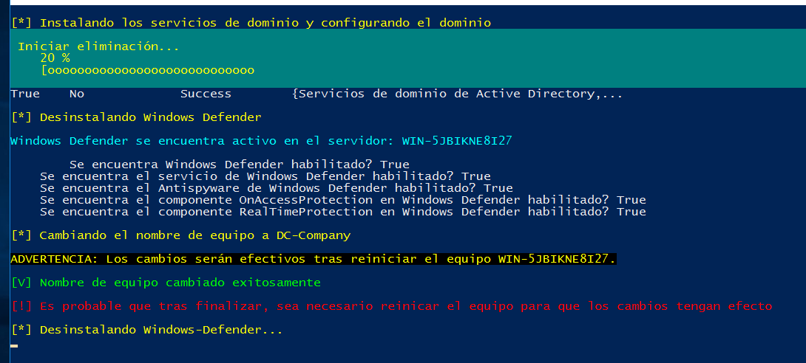
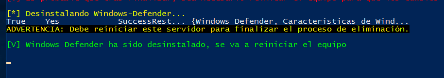
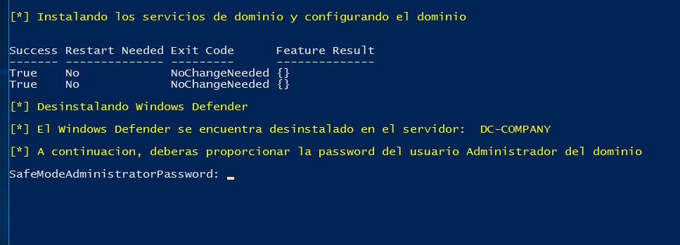
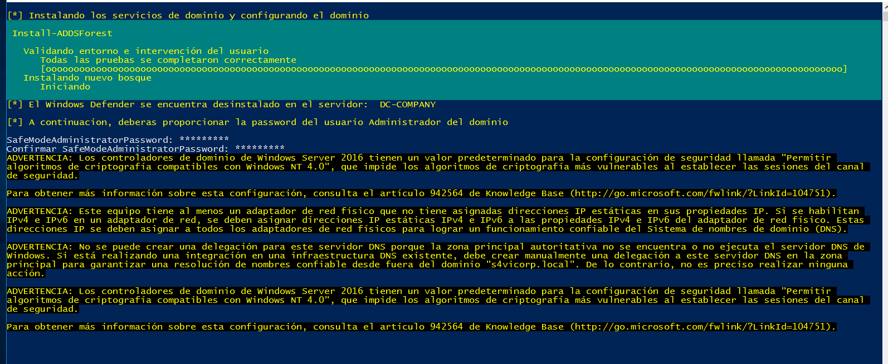
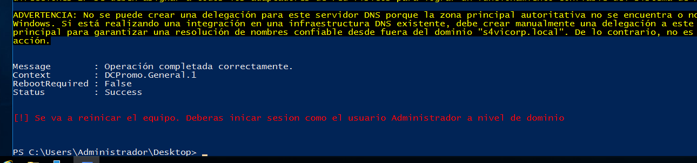
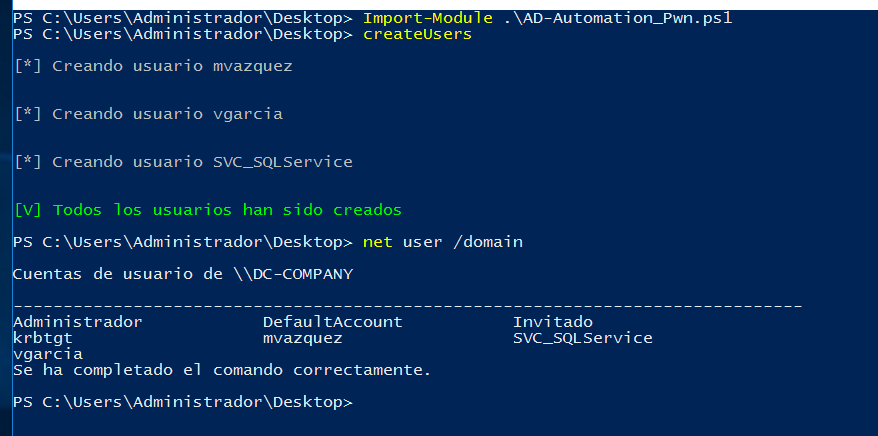
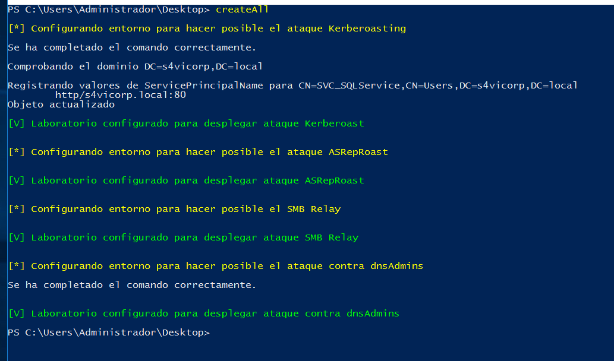

# AD-AutomationLab

**AD-AutomationLab** es una herramienta en PowerShell ideal para desplegar un entorno AD vulnerable de forma automatizada.

Esta herramienta cubre la configuración de los siguientes ataques:

* Kerberoasting Attack
* ASRepRoast Attack
* SMB Relay
* Abuse dnsAdmins
* Golden Ticket Attack
* Silver Ticket Attack
* PassTheHash
* PassTheTicket

Para aquellos/as que quieran ver el desarrollo de este script desde cero, os dejo el siguiente vídeo de mi canal de YouTube:

- [Pentesting en entornos AD #3 - Bloodhound, DCSync, dnsAdmins, SCFiles, evil-winrm](https://www.youtube.com/watch?v=7z7So-2XVis)

¿Quieres aprender más acerca de ataques en entornos AD?, te dejo por aquí los siguientes vídeos de mi canal:

- [Pentesting en entornos AD #2 - Kerberoasting, ASRepRoast, Golden Ticket, PassTheTicket](https://www.youtube.com/watch?v=KYFlvFfh-Js)
- [Pentesting en entornos AD #1 - Samba Relay, PassTheHash](https://www.youtube.com/watch?v=LLevcaB4qew)
- [Máquina Sauna - HackTheBox | GetNPUsers, DCsync y uso de Bloodhound ](https://www.youtube.com/watch?v=3pnyfi8Fn6g)
- [Máquina Resolute - HackTheBox | Abuse DNS Admins](https://www.youtube.com/watch?v=4WuUXboQBh0)
- [Máquina Monteverde - HackTheBox | Uso de evil-winrm](https://www.youtube.com/watch?v=3jOlFPy8Ug0)
- [Máquina Active - HackTheBox | SYSVOL, GPP-Decrypt, GetADUsers.py y GetUserSPNs.py](https://www.youtube.com/watch?v=bFmBBgncY4o)
- [Máquina Mantis - HackTheBox | ldapdomaindump y goldenPac Attack](https://www.youtube.com/watch?v=BO7_1s8y8zM)
- [Máquina Sizzle - HackTheBox | SCF Files, Bloodhound, Neo4j, SharpHound, Impacket](https://www.youtube.com/watch?v=0rmG5EneRuQ)

Requisitos
======
Todas las pruebas han sido realizadas sobre un Windows Server 2016. En caso de usar otra versión hay que tener en cuenta que ciertos parámetros como -DomainMode o -ForestMode deben ser cambiados, pues de lo contrario pueden surgir inconvenientes.

**Mi recomendación**: Usa Windows Server 2016 para desplegar este script.

¿Cómo ejecuto la herramienta?
======
Tras importar el módulo, será posible a través del comando '**helpPanel**', saber en todo momento qué pasos hay que ejecutar:

El primer paso, consistirá en ejecutar el comando **domainServicesInstallation**, el cual se encargará en primer lugar de cambiar el nombre del equipo y de desinstalar el Windows Defender en caso de detectarlo.

Tras ejecutar este comando, comenzará la instalación de los servicios de dominio, incluyendo algunos módulos y utilidades como RSAT-ADDS, ServerManager y ADDSDeployment:

Una vez terminado, el Windows Defender será desinstalado y el nombre de equipo habrá sido cambiado, siendo necesario un reinicio del equipo (se hace de forma automática):

Este debería ser el último mensaje que se tendría que ver:

Tras aplicar el reinicio, se deberá ejecutar nuevamente el comando **domainServicesInstallation**, pues en este caso, no se detectará el Windows Defender instalado y se procederá a la configuración del dominio en el servidor:

En este punto, deberemos introducir la contraseña deseada para el usuario Administrador del dominio, las cuales estaremos utilizando en el siguiente reinicio del sistema.

Una vez introducidas las contraseñas, deberemos ver algo como esto:

Lo que sale en amarillo no son más que advertencias, por lo que por el momento no nos preocuparemos.

Después de unos minutos, deberemos ver este último mensaje:

Por lo que se reiniciará el equipo. Es posible que tras el reinicio haya que esperar unos minutos, pues se realizarán una serie de configuraciones sobre el servidor para que actúe como dominio.

El próximo inicio de sesión, se hará como usuario Administrador del dominio, siendo necesario introducir la contraseña previamente definida para dicho usuario:

Ya casi terminando, volvemos a importar el módulo y haremos uso de la función **createUsers** para crear los usuarios en el AD:

Por último, ejecutamos el comando **createAll** para configurar todos los ataques descritos:

En este punto, ya deberíamos poder ejecutar todos los ataques vistos en la saga de 'Pentesting en entornos AD' disponible en mi canal de YouTube.

Cabe decir que en este caso, no estamos conectado ninguna máquina al dominio. En los vídeos de mi canal, conectamos 2 máquinas de usuario/empleado al DC para de esta forma tras desplegar el ataque del SMB Relay, ser capaces de interceptar los Hashes NTLM de los usuarios vgarcia y mvazquez. Importante recordar que para que este ataque en concreto sea posible, es necesario en el equipo 'Marcelo-PC', hacer al usuario 'vgarcia' usuario administrador local del equipo 'Marcelo-PC' o viceversa, es decir, al usuario 'mvazquez' hacerlo miembro del grupo administradores locales del equipo 'Victor-PC'. De esta forma, el Relaying dará un **SUCCESS** pudiendo así interceptar lo que nos interesa, derivando el ataque incluso a ejecución remota de comandos.

